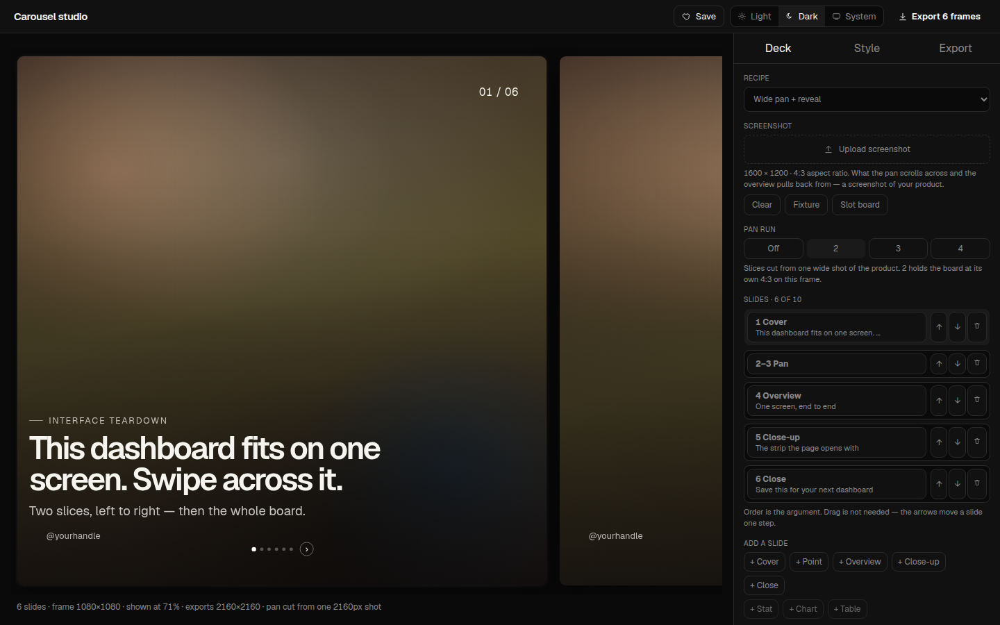

# Carousel studio

Client-only Instagram / LinkedIn carousel composer. The deck lives in the URL; PNGs download locally. No backend.



Inspired by [DashboardStack Carousel Studio](https://studio.dashboardstack.sh). Clean-room rebuild — original fixtures and planes, not their source.

## Quick start

```bash
npm i && npm run dev
```

Open [http://127.0.0.1:5173](http://127.0.0.1:5173).

```bash
npm test
npm run build
```

## What you get

- Horizontal filmstrip of the deck (cover, pan, overview, close-up, close)
- URL-as-state — every knob is a query param; Save copies the link
- Local PNG export at 1× / 2× / 3× (pan is one wide raster, then sliced)
- No account, no upload API, no server

More shots: [Style](docs/screenshots/02-style.png) · [Export](docs/screenshots/03-export.png) · [IG portrait](docs/screenshots/04-extra.png)

## Share URL

`d=` is UTF-8 JSON encoded as base64url (no padding):

```ts
{ p, h?, s: [{ k, f?, c?, t?, b? }] }
```

`p` is pan slices (2–4, or `0` off). `h` is the handle. Slide kinds: `cover`, `pan`, `overview`, `closeup`, `stat`, `chart`, `table`, `point`, `cta`. Unknown kinds drop. At most one pan. A pan costs `p` frames. Total frames ≤ 10. An empty deck becomes one cover.

A known share link that must round-trip:

```
?d=eyJwIjoyLCJoIjoiQHlvdXJoYW5kbGUiLCJzIjpbeyJrIjoiY292ZXIiLCJjIjoiSW50ZXJmYWNlIHRlYXJkb3duIiwidCI6IlRoaXMgZGFzaGJvYXJkIGZpdHMgb24gb25lIHNjcmVlbi4gU3dpcGUgYWNyb3NzIGl0LiIsImIiOiJUd28gc2xpY2VzLCBsZWZ0IHRvIHJpZ2h0IOKAlCB0aGVuIHRoZSB3aG9sZSBib2FyZC4ifSx7ImsiOiJwYW4ifSx7ImsiOiJvdmVydmlldyIsImMiOiJBbGwgb2YgaXQiLCJ0IjoiT25lIHNjcmVlbiwgZW5kIHRvIGVuZCIsImIiOiJTdHJpcCwgaGVybyBwbG90LCB0YWJsZS4gTm90aGluZyBiZWxvdyB0aGUgZm9sZC4ifSx7ImsiOiJjbG9zZXVwIiwiZiI6InRsIiwiYyI6IlRvcCBsZWZ0IiwidCI6IlRoZSBzdHJpcCB0aGUgcGFnZSBvcGVucyB3aXRoIn0seyJrIjoiY3RhIiwidCI6IlNhdmUgdGhpcyBmb3IgeW91ciBuZXh0IGRhc2hib2FyZCIsImIiOiJGb2xsb3cgZm9yIHRlYXJkb3ducyBvZiB0aGUgaW50ZXJmYWNlcyB5b3UgdXNlIGV2ZXJ5IGRheS4ifV19&recipe=wide-pan&style=liquid&kpi=ring&panel=outline&plane=img-23&frame=ig-square
```

That payload is pan=2, handle `@yourhandle`, slides cover → pan → overview → closeup(tl) → cta. Six frames because the pan counts as two.

`shot=fixture` uses the shipped 1600×1200 still. A file upload stays on a local object URL and is not written into the link. `plane=img-23` (or any unknown `img-*`) maps to a generated photo plane — this app does not fetch DashboardStack `/images`.

[URL knobs](#url-knobs)

## License

[MIT](LICENSE) · Copyright 2026 [Mohtasham Madani](https://github.com/MohtashamMurshid)

## URL knobs

Omit a key to use the default. Bools accept `true`/`1` and `false`/`0`. `res` is `1`, `2`, or `3`. Close-up fill is `tl` / `tr` / `bl` / `br` / `center` (or `zoom,x,y`).

`recipe` `style` `kpi` `panel` `inset` `kpis` `slots` `shot` `plane` `blur` `radius` `frame` `res` `pad` `gap` `fill` `chart` `text` `ink` `scrim` `scrimh` `shadow` `shadowb` `cpad` `mode` `flow` `nums` `dots` `arrow` `safe`
